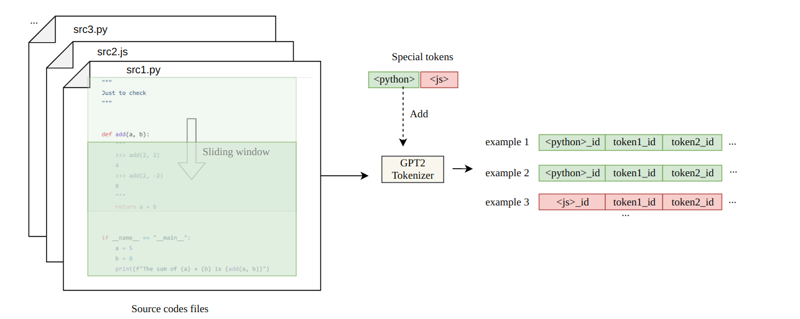
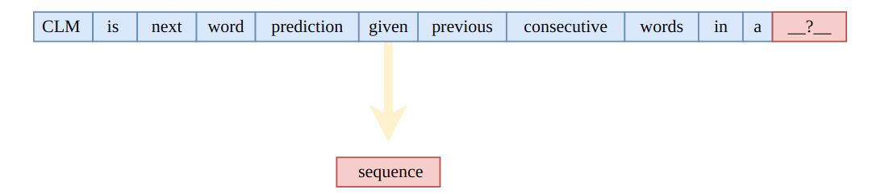

<h1 align="center"><p>IVolution Autocompleter</p></h1>

> An autocompleter for code editors based on [OpenAI GPT-2](https://github.com/openai/gpt-2).

### 🏠 [Homepage](https://ivolution.ai/)

**Ivolution** is an auto code completer for code editors (or any text editor) based on [OpenAI GPT-2](https://github.com/openai/gpt-2). It is trained (finetuned) on a curated list of approximately 45K Python (~470MB) files gathered from the Github. Currently, it just works properly on Python but not bad at other languages (thanks to GPT-2's power).


## Installation

### With Docker

Clone the repository:

```sh
git clone https://github.com/Ivolutionnow/ivolution-backend
```

Download the latest model from releases and uncompress it into the directory:

```sh
curl -SL https://github.com/Ivolutionnow/ivolution-backend/releases/latest/download/model.tar.xz | tar -xJC ./ivolutioncoding

```

Install dependencies:

```sh
pip3 install -r requirements.txt
```

P.S.: Be sure that you have tensorflow version >= 1.13

Run the autocompleter:

```sh
python3 main.py
```

## Usage

Currently, there are no extensions for code editors. You can use it through HTTP. When you run the `main.py`, it will serve an HTTP (flask) server. Then you can easily make a POST request to the http://localhost:3030/ with the some `JSON` body like the following:

```sh
{text: "your python code goes here"}
```

An example curl command:

```sh
curl -X POST \
  http://localhost:3030/autocomplete \
  -H 'Content-Type: application/json' \
  -d '{"text":"import os\nimport sys\n# Count lines of codes in the given directory, separated by file extension.\ndef main(directory):\n  line_count = {}\n  for filename in os.listdir(directory):\n    _, ext = os.path.splitext(filename)\n    if ext not"}'
```

Also you can use plugin for VSCode [https://github.com/Ivolutionnow/ivolution-vscode](https://github.com/Ivolutionnow/ivolution-vscode) for most usability realtime testing.

## Finetuning The Model

Even you can finetune (re-train over) the model with/for your code files. Just follow the `Max Woolf's` [gpt-2-simple](https://github.com/minimaxir/gpt-2-simple) or `Neil Shepperd's` [gpt-2](https://github.com/nshepperd/gpt-2) repositories with **`345M`** version. But don't forget to replace checkpoint (model) with the one in this repository.

<h1 align="center"><p>Prepare Dataset</p></h1>

We know that initially GPT-2 was made for understanding casual English by pre-learning. However we don't need to bound it only by casual English. In other words, the reason it generates successive paragraphs of text is because it “knows” well how to display the next prompt, given context, as input in the sequence. The text simply matches the pattern, where the next clue is the next word and the context is the previous words in the sentence.



With this kind of understanding, it is easy to assume that GPT-2 can be used for tasks involving sequence-like datasets. It is possible to solve problems related to images (for example, Image-GPT) if we think of an image as a sequence of numeric pixels. Music-related tasks are possible if we think of a piece of music as a sequence of notes, like MuseNet.

If we think about GPT-2 or any other deep models from a mathematical point of view, then everything immediately falls into place. The truth is that these models just know numbers and don't know things like position, faces, colors, or words directly. They may know different words indirectly because different words are represented by vectors (just different numbers) before being fed into the model. They know the positions because the positions before serving in the model are represented by different numbers.

Programming language codes can be taken as sequential analogous data, and thus GPT-2 can solve the problem of code hinting.

A bit of thought about preparing a dataset for solving a code hint problem.

There are many open source libraries for this purpose that provide large amounts of code. As a starting point, check out the Algorithm Library. It is important that the model helps to automatically fill in codes at a general level. Basic Algorithm Codes are suitable for these needs. Also, I believe the codes from The Algorithms are well written (high quality codes). Since the task requires the model to be able to generate Python and JS codes, to begin with, you can simply clone the corresponding repositories from The Algorithms. Then you should pay attention to the snippet templates for the IDE - as they are great for fine-tuning the ruGTP3 model by their methodics Тема:Сочинение (Topic:essay). Snippets are the best solution for fast receiving dataset in that format.

## TASK

You need to take the web server code from this project as a basis to maintain backward compatibility with the plugin for VSCode.

Use the [transformers](https://github.com/huggingface/transformershttps://github.com/huggingface/transformers) models library to output data from the model. In particular, use the GPT2Tokenizer.

Use DeepSpeed for FineTuning a model.

As a basis for using and fine-tuning the model, you can use a ready-made playground from the colab

https://colab.research.google.com/drive/1VYLdWyX6z0AuOdyBZbylogiweHPGbOBD#scrollTo=I7TAeZbRrYzF

It is necessary to prepare a dataset for the FineTuning of [ruGPT3](https://github.com/sberbank-ai/ru-gpts) model. The size of the dataset should correspond to the selected model (ruGPT3_large) and give relevant hints when writing basic code constructs (basic while \ for loops, promises, etc.) - the approximate size of the dataset, provided that its quality when selecting it corresponds to the features of the encoder - 400MB

Adapt the backend of the current version of IvolutionCoding to work with the ruGPT3_large model.

At the output, it is necessary for the ruGPT3-large model after FineTuning to give out relevant code hints, interact with the backend, which, in turn, can do rest-api and gives data to the plugin for the IDE
